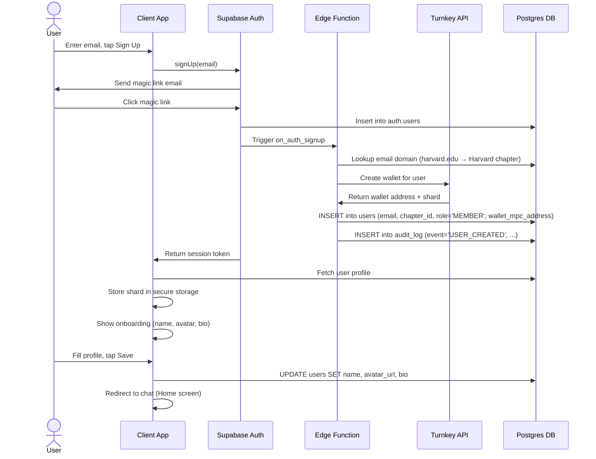
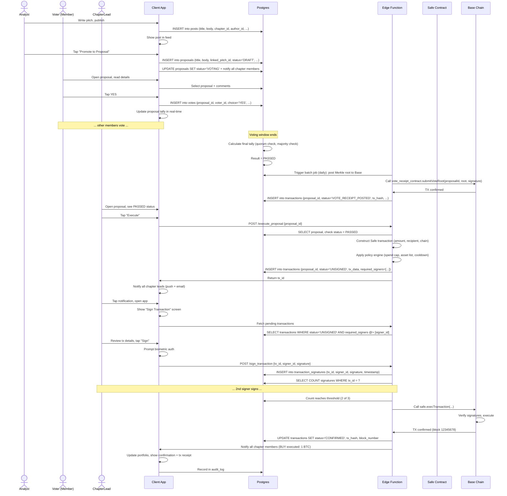
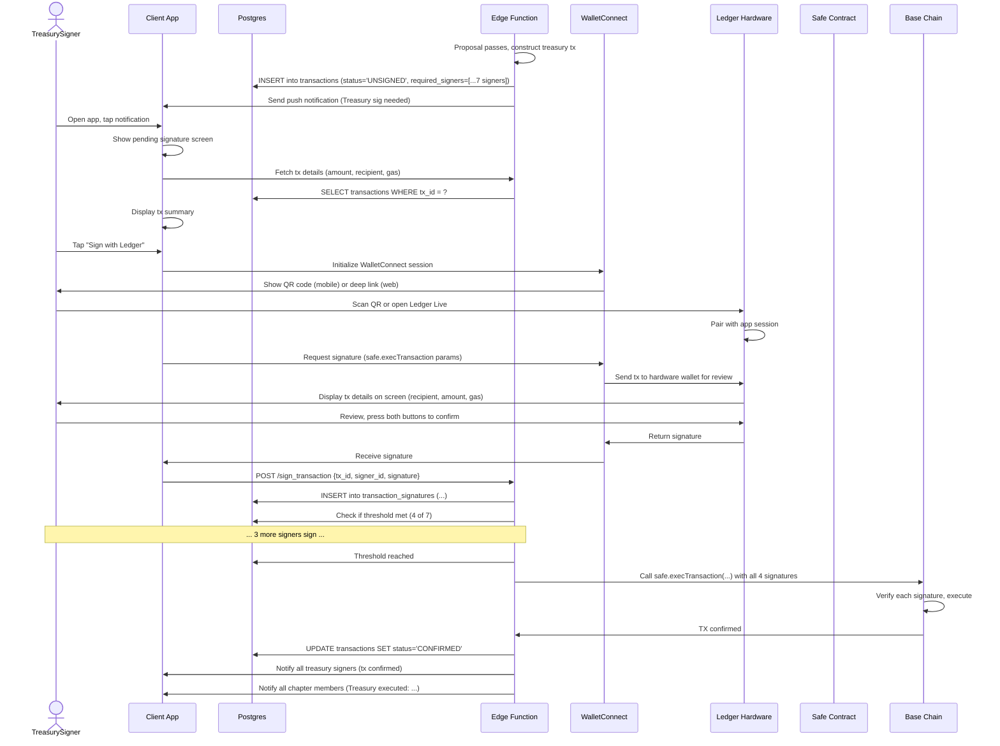

# DormDAO Technical Architecture

## System Overview

DormDAO is a three-tier system: mobile/web client (React Native + web) ↔ Supabase backend (auth, DB, realtime, storage, edge functions) ↔ custody providers (Turnkey, Safe, Ledger) and blockchains (Base, Arbitrum).

The client is a single Expo codebase shipping to iOS, Android, and web (PWA). All data access is mediated by Supabase Row-Level Security policies. Signing (custody) is handled by specialized providers; the backend never holds private keys.

---

## System Architecture Diagram

```mermaid
graph TB
    Mobile["📱 Mobile Client<br/>(Expo: iOS/Android)"]
    Web["🌐 Web Client<br/>(Expo web + PWA)"]
    
    Client["Client Layer<br/>React Native + Expo Router<br/>NativeWind styling<br/>TanStack Query + Zustand"]
    
    Auth["🔐 Supabase Auth<br/>Magic link + OAuth"]
    DB["💾 Postgres DB<br/>RLS policies on every table<br/>Realtime subscriptions"]
    Storage["📦 Supabase Storage<br/>File attachments"]
    EdgeFunc["⚙️ Edge Functions<br/>Proposal logic<br/>Tx construction<br/>Webhook handlers"]
    
    Supabase["Supabase Backend"]
    
    Turnkey["🔑 Turnkey MPC<br/>Member wallets<br/>Policy engine"]
    Safe["🔐 Safe (Gnosis)<br/>Chapter & Treasury Safes<br/>Multisig logic"]
    Ledger["💳 Ledger + WalletConnect<br/>Treasury signing"]
    
    Custody["Custody Layer"]
    
    Base["⛓️ Base Chain<br/>Chapter Safes<br/>Treasury Safe<br/>Vote receipts"]
    Arbitrum["⛓️ Arbitrum<br/>Backup chapter Safes"]
    
    Blockchain["Blockchain Layer"]
    
    Mobile --> Client
    Web --> Client
    
    Client -->|Auth requests| Auth
    Client -->|Read/write (RLS enforced)| DB
    Client -->|Upload/download| Storage
    Client -->|Realtime subscriptions| DB
    Client -->|Proposal, tx, webhook handlers| EdgeFunc
    
    Auth --> Supabase
    DB --> Supabase
    Storage --> Supabase
    EdgeFunc --> Supabase
    
    EdgeFunc -->|Create/sign wallets| Turnkey
    EdgeFunc -->|Construct Safe tx| Safe
    Client -->|Sign with Ledger| Ledger
    
    Turnkey --> Custody
    Safe --> Custody
    Ledger --> Custody
    
    EdgeFunc -->|Broadcast tx, read state| Base
    EdgeFunc -->|Broadcast tx, read state| Arbitrum
    
    Base --> Blockchain
    Arbitrum --> Blockchain
    
    style Client fill:#e1f5ff
    style Supabase fill:#f3e5f5
    style Custody fill:#fff3e0
    style Blockchain fill:#e8f5e9
```

---

## Detailed Architecture

### 1. Client Layer

**Tech Stack**
- **Framework**: Expo (managed workflow) with Expo Router for navigation.
- **Styling**: NativeWind (Tailwind for React Native).
- **State Management**:
  - **Server State**: TanStack Query v5 (React Query). Manages async API calls, caching, background refetching, optimistic updates. Used for chat, proposals, posts, transactions.
  - **Ephemeral UI State**: Zustand. Manages UI-only state like sheet visibility, form inputs, selected filters.
- **Rich Text**: Tiptap (headless editor; supports web, configurable RN with custom plugins). For MVP, Markdown alternative (simpler, RN-native).
- **Charts**: `react-native-chart-kit` for portfolio overview.
- **Realtime**: `@supabase/supabase-js` Realtime subscriptions (messages, votes, presence).
- **Crypto**: `ethers.js` v6 for transaction construction, ABIs, and chain interaction.
- **Notifications**: Expo Notifications SDK for push; deep linking via `expo-linking`.
- **Authentication**: Supabase Auth SDK; magic link + OAuth (Google).
- **Secure Storage**: `expo-secure-store` for Turnkey key shards (mobile); custom encrypted localStorage (web).

**Trade-off: Tiptap vs Slate vs Custom**
- **Tiptap**: Industry standard, headless, plugin-based, strong community. Custom RN renderer required; upgrade path to advanced features. Best for long-term.
- **Slate**: More customizable, steeper learning curve, weaker RN support.
- **Custom Markdown**: Simpler MVP (no WYSIWYG), lower barrier to ship.
- **Recommendation**: Ship Markdown MVP in Phase 2; upgrade to Tiptap in Phase 2.5 once RN renderer is built.

**Code Structure**
```
app/
  (auth)/          # Public routes (login, signup)
  (app)/           # Protected routes (app shell)
    (chat)/        # Chat screens
    (proposals)/   # Voting screens
    (posts)/       # Blog screens
    (wallet)/      # Custody screens
    _layout.tsx    # App root with RLS provider, notifications
lib/
  api/             # API client (wrapped Supabase)
  hooks/           # React hooks (useProposal, useChat, etc.)
  store/           # Zustand stores (uiState, authState)
  types.ts         # TypeScript interfaces
components/
  chat/            # Chat components (MessageList, MessageInput, etc.)
  proposals/       # Proposal components
  common/          # Reusable (Button, Card, Avatar, etc.)
```

**Build Targets**
- **iOS**: EAS Build (managed; no local Xcode required). Builds to IPA, uploaded to App Store via Testflight.
- **Android**: EAS Build to APK / AAB, uploaded to Google Play via internal testing first.
- **Web**: `expo export` → static HTML/CSS/JS, deployed to Vercel. PWA manifest added in `public/manifest.json`.

---

### 2. Backend Layer: Supabase

**Supabase Components**

**Authentication**
- Supabase Auth: magic link + Google OAuth provider.
- New signup flow:
  1. Email entered.
  2. Supabase sends magic link.
  3. User clicks link → `auth.signUp()` callback triggers.
  4. Edge Function `on_auth_signup` fires (trigger on `auth.users` insert); auto-creates user profile + auto-assigns chapter (via email domain lookup).
- OAuth flow: "Sign in with Google" button → Supabase redirects to Google → callback to app with session token.
- Sessions: JWT token stored in secure storage (mobile) / secure HTTP-only cookie (web). Refreshed automatically by SDK.

**Database (Postgres)**
- Full schema in 02-data-model.md.
- Key design principles:
  - **RLS on every table**: No table readable/writable without explicit policy (deny-by-default).
  - **Soft deletes**: Messages, posts, users marked with `deleted_at` (never hard-deleted).
  - **Audit trail**: Every mutation logged to `audit_log` (via Edge Function or database trigger).
  - **Realtime publications**: Selected tables enable Realtime subscriptions (messages, votes, presence).

**Realtime**
- Supabase Realtime (powered by Postgres logical decoding) publishes changes to channels.
- **Subscriptions**:
  - `messages:channel_id:*` → new messages, reactions, deletions in channel.
  - `votes:proposal_id:*` → vote cast events.
  - `presence:chapter_id:*` → user online/offline/typing.
- Client subscribes on mount; unsubscribes on unmount to prevent memory leaks.
- Realtime messages use PostgreSQL LISTEN/NOTIFY under the hood; published to all connected clients.

**Storage**
- Supabase Storage (backed by AWS S3).
- Buckets:
  - `attachments/` (private, accessible only to user who uploaded).
  - `avatars/` (public, CDN-cached).
  - `posts_media/` (private).
- Upload URL signed via Edge Function (1-hour expiry).
- File size limits: 50 MB per file, 10 files per message.

**Edge Functions**
- Supabase Edge Functions (Deno-based, run on Deno Deploy CDN).
- Functions handle:
  - **Custody logic**: `construct_transaction`, `broadcast_transaction`, wallet creation, policy enforcement.
  - **Webhook handlers**: Turnkey events (tx signed), Persona KYC results, Chainalysis screening results.
  - **Auth lifecycle**: `on_auth_signup` (auto-create profile + chapter).
  - **Batch operations**: Daily audit log export, vote Merkle root posting.

**RLS Policies**
- Example: `messages` table.
  - SELECT: User is in channel (via `users_in_channels` join) OR is message author.
  - INSERT: User is in channel AND not deleted AND message is not longer than 10k chars.
  - UPDATE/DELETE: Only message author can update/soft-delete.
- Example: `proposals` table.
  - SELECT: User is in chapter (for chapter proposal) OR proposal is public.
  - INSERT: User is Chapter Lead or Analyst in chapter.
  - UPDATE: Only proposer can update status; system updates via Edge Function.

---

### 3. Custody Layer

**Member Wallets (Turnkey MPC)**
- Turnkey API creates a wallet on signup (via Edge Function `on_auth_signup`).
- Turnkey generates a key shard; client receives second shard (stored in secure storage).
- Turnkey also holds the third shard (encrypted, never leaves Turnkey servers).
- To sign a transaction:
  1. Client constructs tx (amount, recipient, chain).
  2. Client submits tx + local shard to Turnkey.
  3. Turnkey verifies tx against policies, combines shards, signs, returns signature.
  4. Client broadcasts signature to chain.
- Turnkey policy engine enforces: daily spend cap, asset allowlist, rate limits, geo-fencing (optional).
- Wallets deployed on Base and Arbitrum.

**Chapter Wallets (Safe Multisig)**
- On chapter creation (Org Admin), Edge Function deploys a Safe contract on Base.
  - Signers: Chapter Leads (e.g., 3 leads).
  - Threshold: N-of-M (e.g., 2-of-3, Chapter Lead decides).
- Chapter Lead can add/remove signers via `chapter_settings`.
- To execute a proposal:
  1. Edge Function constructs Safe transaction (unsigned).
  2. Notifications sent to all N signers.
  3. Each signer opens app → views tx → signs locally (via ethers.js or WalletConnect if using external wallet).
  4. When M signatures collected → Edge Function calls `execTransaction` on Safe.

**Treasury Wallet (Safe + Ledger)**
- Org Admin creates a Safe on Base with 7 Treasury Signers.
- Each Treasury Signer connects a Ledger Nano X hardware wallet.
- Signer must have passed KYC (Persona).
- To sign:
  1. Signer receives notification of pending tx.
  2. Opens app → navigates to pending signatures.
  3. Taps "Sign with Ledger" → WalletConnect modal opens.
  4. Ledger app (on hardware wallet) confirms signature request.
  5. Signature returned to app, submitted.

---

### 4. Blockchain Layer

**Base Chain**
- Primary deployment for all Safes (chapter + treasury).
- Why Base: low fees, fast finality, Coinbase ecosystem credibility, EIP-4337 support (account abstraction for future).
- Vote receipt contract deployed at launch:
  - Stores proposal ID, Merkle root of votes, signature from org key, timestamp.
  - `verifyVote(proposalId, voterAddress, voteChoice, merkleProof)` function allows anyone to verify their vote.

**Arbitrum (Secondary)**
- Deployed for disaster recovery / geographic redundancy.
- All chapter Safes have a clone on Arbitrum (same threshold, same signers).
- If Base is unavailable, Org Admin can promote Arbitrum Safe to primary (requires governance vote or emergency override).

---

## Sequence Diagrams

### Sequence 1: Member Signup + Chapter Assignment



**Timing**: ~3 sec (magic link click → chat ready).

---

### Sequence 2: Pitch → Proposal → Vote → Execution (End-to-End)



**Timing**: Pitch to proposal ~2 sec; vote ~500 ms; result posting ~5 min; execution time (approval to broadcast) depends on signer response (~1-10 min for chapter); on-chain confirmation ~30 sec.

---

### Sequence 3: Treasury Multisig Signing with Ledger



**Timing**: ~2 min per signer (including Ledger interaction); total time 10 min (4 signers in series).

---

## Technology Justifications

**React Native + Expo**
- **Why**: Single codebase ships to iOS, Android, and web. Managed build service (EAS) eliminates build complexity. Expo Router is production-grade navigation (from Wix team).
- **Trade-off**: Less control over native modules than bare React Native, but ecosystem is mature and has 99% of needed packages. If needed later, can eject to bare workflow.

**Supabase**
- **Why**: Postgres + Auth + Realtime + Storage + Edge Functions in one platform. RLS is industry-standard for mobile backends. Pricing scales with usage (good for startup). Postgres is reliable, well-understood, auditable.
- **Trade-off**: Vendor lock-in; edge functions are Deno-based (not Node), smaller ecosystem. Mitigation: all data is portable (standard Postgres); edge functions are lightweight (can be migrated to Cloud Run / Lambda).

**Turnkey for MPC Wallets**
- **Why**: Stronger policy engine than Privy (per-transaction rules, geo-fencing, KYC integration). SOC 2 Type II certified. No seed phrase ever held by member (maximum security). Integrates with Safe for multisig governance.
- **Trade-off**: Higher cost (~$0.05-0.10 per tx vs Privy's ~$0.02 per tx); steeper integration effort. Justification: Security > cost at this risk tier.
- **Cost**: ~$250/month for 25 chapters × 50 members × 2 txs/member/month @ $0.05/tx.

**Safe for Multisig**
- **Why**: Audited, battle-tested (billions locked), standard contract (all chains support it). Integrates with hardware wallets (Ledger, Trezor). No DormDAO-specific code needed.
- **Trade-off**: Not upgradeable without governance; requires N signers to approve threshold changes. Mitigation: document upgrade procedure in 04-custody-spec.md.

**Ledger Hardware Wallets**
- **Why**: Physical devices guarantee private keys never leave hardware. Industry standard for large asset holders. Insurance-friendly (Ledger wallets qualify for Coincover reimbursement).
- **Trade-off**: Requires WalletConnect integration; signing is slower (~2 min/signer). Justification: Worth the UX cost for treasury tier.

**Base Chain**
- **Why**: Lowest fees (avg 0.01 USD/tx), fast finality (2-12 sec), Coinbase credibility (regulatory friendly). Supports EIP-4337 (account abstraction).
- **Trade-off**: Less liquidity than Ethereum mainnet; smaller ecosystem. Mitigation: Uniswap, Aave, other major protocols live on Base; acceptable trade-off for a DAO deploying capital, not trading microsecond latencies.

**TanStack Query**
- **Why**: Industry-standard for React server state. Automatic caching, background refetching, optimistic updates. Significantly reduces loading states and network requests.
- **Trade-off**: Requires discipline to structure queries well. Mitigation: document query key patterns in codebase.

**Zustand**
- **Why**: Lightweight (no boilerplate), TypeScript-first, Immer integration. Used by Vercel, Airbnb internally.
- **Trade-off**: Not as feature-rich as Redux. Mitigation: Only used for ephemeral UI state, not business logic.

**Sentry + PostHog**
- **Why**: Sentry for error tracking (native support for RN + web). PostHog for product analytics + feature flags. Both privacy-friendly (can be self-hosted).
- **Cost**: ~$50/month Sentry + ~$100/month PostHog for this scale.

---

## Deployment Architecture

**Development Environment**
```
Local repo → GitHub (dev branch)
  ↓ (PR opened)
GitHub → GitHub Actions (run tests, lint)
  ↓ (PR merged to main)
main → EAS Build (scheduled nightly)
  ↓ (APK/IPA built)
EAS → TestFlight (beta distribution)
```

**Production Deployment**
```
main branch (release tag)
  ↓ (GitHub Actions triggered)
EAS Build (release profile)
  ↓
iOS: IPA → App Store Connect → App Review → App Store
Android: AAB → Google Play Console → Play Store
Web: expo export → Vercel → CDN
```

**Supabase Deployment**
- Production Supabase project (separate from staging).
- Edge Functions deployed via `supabase functions deploy`.
- Database migrations via `supabase db push` (with review).
- RLS policies version-controlled in `.sql` files, reviewed in PR.

---

## Error Handling & Recovery

**Network Errors**
- Client-side: TanStack Query automatically retries failed requests with exponential backoff (default: 3 retries).
- Realtime errors: automatic reconnection (30 sec backoff).
- UX: toast notification ("Connection error, retrying…"), retry button visible.

**Custody Errors**
- Turnkey tx rejection (policy violation): Edge Function returns 400 with reason (e.g., "Exceeds spend cap"). Client shows error modal with explanation + suggests contacting Chapter Lead.
- Safe signature collection timeout (signers don't sign for 48 hours): Org Admin can cancel tx, propose new one.
- Ledger signing failure: User can try again; Deep link preserves tx context.

**Database Errors**
- RLS policy violation (e.g., Member tries to update Chapter wallet): Supabase returns 403. Client shows "Permission denied" message.
- Concurrent edit conflict (two users edit proposal description simultaneously): Last write wins; both users see final version in real-time via Realtime subscription.

**Blockchain Errors**
- TX revert on Base (e.g., slippage on swap): Edge Function detects failed receipt, updates transaction status to `FAILED`. Org Admin can retry (reconstruct tx).
- Temporary RPC outage: Edge Function has fallback RPC endpoints (e.g., Alchemy, QuickNode). Automatic failover.

---

## Security Considerations

**Private Key Management**
- ✅ Member MPC keys: sharded across device + Turnkey (member never handles full key).
- ✅ Chapter Lead keys: stored in secure storage on mobile; optional hardware wallets (Ledger).
- ✅ Treasury Signer keys: Ledger hardware only; never in software.
- ✅ Org Admin keys (for signing vote receipts): Stored in Supabase Secrets (encrypted at rest, audit-logged on access).

**RLS Policies**
- ✅ Deny-by-default: every table has explicit policies; no implicit allow.
- ✅ Chapter isolation: Members of chapter A cannot read/write chapter B's data.
- ✅ Role-based access: proposal approval flows enforce role permissions at database level.

**Audit Logging**
- ✅ All mutations logged: INSERT/UPDATE/DELETE on sensitive tables trigger audit_log entry.
- ✅ Immutable storage: daily export to S3 Object Lock + quarterly to Arweave.
- ✅ Signature verification: audit entries signed with HMAC-SHA256; client can verify integrity.

**Compliance**
- ✅ KYC: Treasury Signers pass Persona KYC before promotion.
- ✅ Jurisdiction checks: members in restricted countries auto-flagged; cannot vote.
- ✅ Transaction screening: Chainalysis/TRM Labs API called before broadcast; high-risk addresses blocked.

---

## Observability

**Metrics** (PostHog)
- DAU / MAU (daily / monthly active users).
- Proposal creation / voting rates.
- Transaction success rate (% of proposed → executed).
- Signer response time (median, p95).

**Logging** (Supabase + Sentry)
- All Edge Function invocations logged (duration, errors).
- Client errors logged to Sentry (RN crashes, JS errors).
- Database query performance monitored (slow query log).

**Alerts**
- Sentry: alerts on error spike (>10% error rate).
- Custom: alerts on high transaction failure rate (>5% in 1 hour).
- Custom: alerts on RLS policy violations (possible security incident).

---

## Scaling Considerations

**Phase 0–3 (5–10 chapters, <1k users)**
- Single Supabase project suffices.
- Database: 1 replica for redundancy.
- Storage: S3 bucket, auto-scale.

**Phase 4–6 (20–25 chapters, ~1.25k users)**
- Database: read replicas in different regions (Americas, EU) for disaster recovery.
- Edge Functions: auto-scale on demand (no configuration needed).
- Cache: Redis layer optional (Supabase doesn't provide, use Upstash if needed); not critical for MVP.

**Post-Phase 6 (expansion to >50 chapters)**
- Consider multi-region setup (US-East + US-West + EU).
- Postgres partitioning on `audit_log` (by month) for faster queries.
- Vector search (pgvector + Supabase) for semantic message search.
- Archive old messages to cold storage (S3 Glacier) after 1 year.

